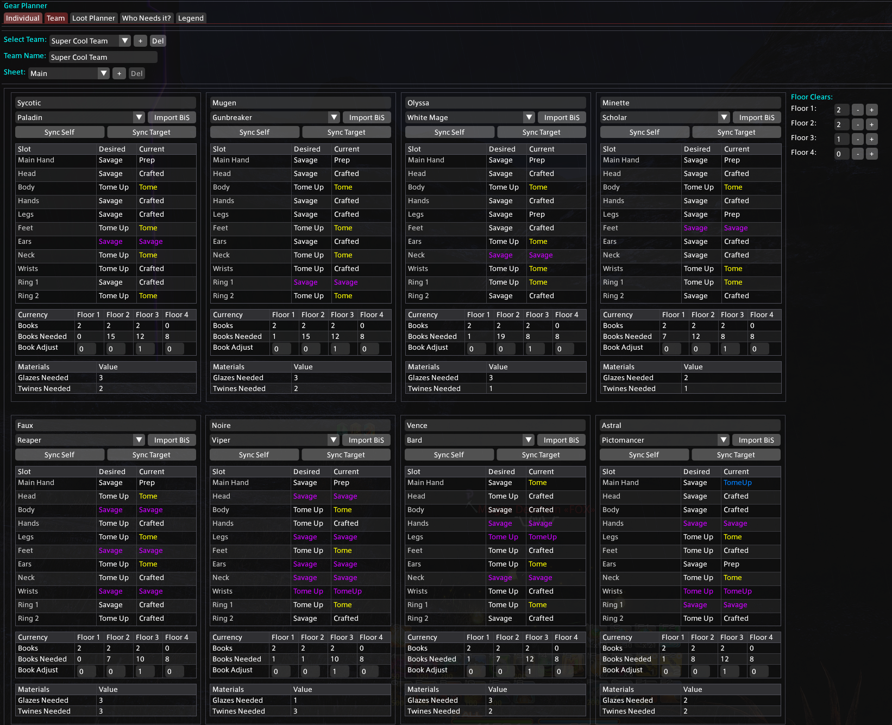
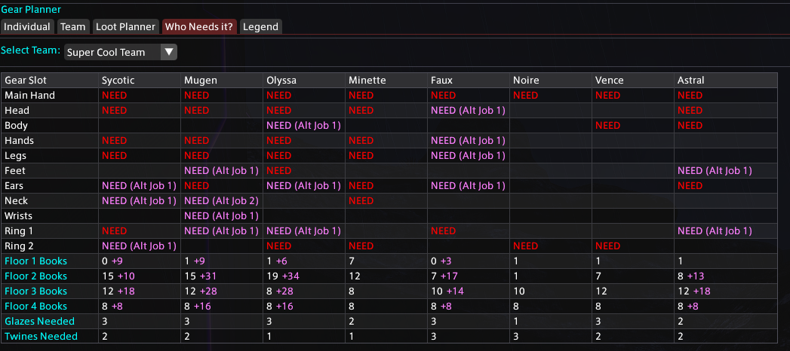

# Gear Planner

A Dalamud plugin for Final Fantasy XIV that helps raid teams plan and track gear distribution across team members and alternative job sheets.

## Requirements

- **Final Fantasy XIV**: Patch 7.4 or later (Endwalker and newer)
- **Dalamud**: Latest version
- **XIVLauncher**: Latest version

## Installation

1. Open Dalamud Settings (`/xlsettings`)
2. Go to **Experimental** → **Custom Plugin Repositories**
3. Add "https://raw.githubusercontent.com/JoshKoshy/GearPlanner/refs/heads/master/GearPlanner/pluginmaster.json"
6. Enable **Gear Planner**
7. Use `/gp` or `/gearplanner` to open the main window

## Features

- Create/manage multiple teams or track individual loot
- Utilize main and alternative job sheets
- Add adjustments for individuals
- Import BiS sheets from xivgear.app
- Sync gear through the game
- Detailed member gear breakdown
- Job and role configuration
- Currency and material tracking
- Detailed priority loot table
- Assign weekly loot plans to team members

## Screenshot




## Usage Tips

- **Syncing Gear**: Use "Sync Self" to capture your current equipment or "Sync Target" to examine another player and sync their equipment to the sheet
- **Book Adjustments**: Individual floor clears can be tracked by adding or subtracting values to this row
- **Loot Hover Text**: Hover over loot items to see which members need them

## Building

```bash
dotnet build GearPlanner.sln -c Debug
```

Output DLL: `GearPlanner/bin/x64/Debug/GearPlanner.dll`
